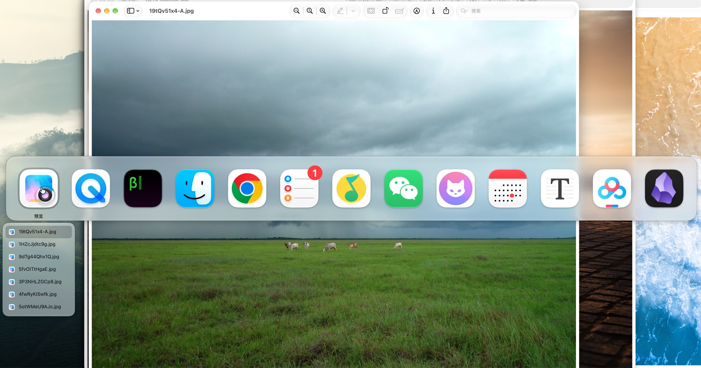
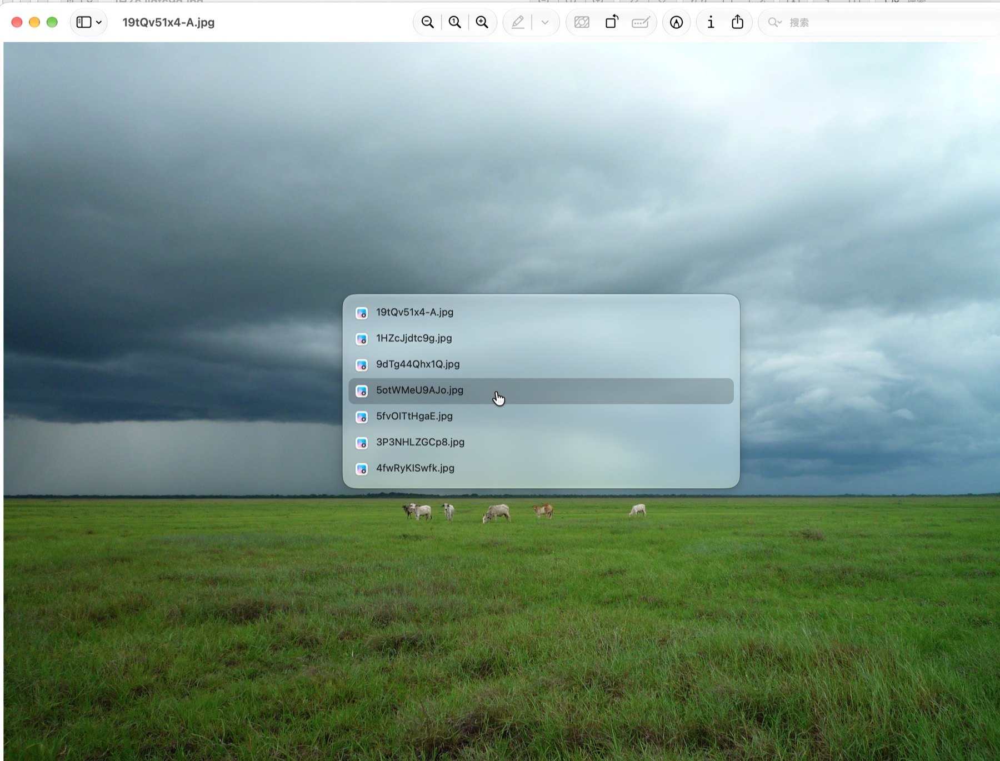

# AppWindow

**[→ Online introduction page](https://wudanyang6.github.io/appwindow/)**

A macOS window switcher focused on a single purpose: switching between apps and windows in a more natural way. Inspired by [Contexts](https://contexts.co/), it keeps the core idea and improves the parts that matter most.

When using the native `Cmd+Tab` to switch apps, you cannot see the current windows and can only cycle through apps one by one. The native `Cmd+`` inside an app is also a step-by-step trial-and-error process. AppWindow turns both into something visible, previewable, and mouse-friendly.

## Features

### Cmd+Tab — Application Switcher

Hold `Cmd` and press `Tab`; a horizontal icon panel appears in the center of the screen with a size close to the system default:



- `Tab` / `→` moves forward, `Shift+Tab` / `←` / `` ` `` moves backward
- `↑` / `↓` selects a window from the highlighted app's window list; releasing `Cmd` switches directly to that window
- Mouse: hover over icons or window rows to move the highlight, click to switch immediately, use the scroll wheel to switch apps, and scroll over the window list to browse
- Applications are ordered by recent use; when the window list exceeds the visible height, it scrolls continuously with up/down indicators
- **One panel is shown per screen**, and state stays synchronized across screens

### Cmd+` — Current App Window Switcher

Hold `Cmd` and press `` ` ``; a popup appears in the center of the screen showing all windows of the current app at roughly 70% of the screen height:



- **Each press of `` ` `` immediately switches to the next window**: repeat to cycle through all windows in order; the window you just left is moved to the end of the cycle and returns only after other windows are visited; release and press again to continue forward
- `↑` / `↓` moves one row and switches immediately
- Mouse: hover to move the highlight without switching, click to select a window and dismiss the panel, use the scroll wheel to scroll the list
- Single-window apps still show a popup (to quickly return to that window)

### Other

- `Esc` or clicking outside the panel dismisses it (`Cmd+`` switch actions are not undone, matching native behavior; `Cmd+Tab` cancels before release)
- The panel is a non-activated window, so it does not steal keyboard focus and stays aligned with your movement
- Requires system appearance in light/dark mode; background uses frosted glass transparency
- Menu bar app (no Dock icon), and can trigger the system authorization dialog when needed

## Installation

### Download

Download the latest DMG from [Releases](../../releases), open it, and drag AppWindow into Applications.

> On first launch, enable AppWindow in `System Settings → Privacy & Security → Accessibility` (the menu bar icon can open this directly).

**If the first launch shows: “Cannot verify that AppWindow.app is malicious”** (on macOS 15/26, right-click “Open” is no longer available), allow it once using either method below:

1. GUI: click “Done” in the prompt, then open System Settings → Privacy & Security and click “Open Anyway” in the “Security” section near the bottom
2. Terminal: `xattr -dr com.apple.quarantine /Applications/AppWindow.app`

### Build from source

Requirements: macOS 14+, Xcode Command Line Tools.

```bash
./scripts/build-app.sh      # Build and assemble AppWindow.app
./scripts/package-dmg.sh    # Optional: package a DMG
```

## Known limitations

- Switching across Spaces / full-screen apps depends on the system `activate` behavior; in some cases it may not jump to the target window's Space
- Uses the private API `_AXUIElementGetWindow` to match CGWindow and AXWindow objects (resolved dynamically via `dlsym`; if unavailable, it falls back to window bounds matching); therefore **it cannot be submitted to the App Store**
- Listens for the physical keycode 50 (ANSI Grave) and does not follow custom system shortcuts
- Window titles come from the Accessibility API and do not require screen recording permission

## Technical implementation

Swift + AppKit (built with SPM). Main components:

```
Sources/Context/
├── main.swift              # Entry point; accessory app (no Dock icon)
├── AppDelegate.swift       # Menu bar, accessibility permission guidance, and polling
├── EventTapManager.swift   # CGEventTap + keyboard state machine (core interaction logic)
├── AppSwitcherPanel.swift  # Cmd+Tab icon panel + window list (multi-screen)
├── SwitchPanel.swift       # Cmd+` window list panel (multi-screen)
├── WindowListService.swift # Window enumeration: CGWindowList z-order + AX titles/references
├── WindowActivator.swift   # Window activation: minimize/restore → AXRaise → activate
├── ListScrolling.swift     # Continuous list-scrolling controller + wheel response container
├── AXHelpers.swift         # Swift wrapper around AX APIs + private symbol isolation
└── Theme.swift             # Global panel appearance settings
```

## License

[GPL-3.0](LICENSE) — any project that uses or modifies this software must also remain open source under GPL-3.0.

